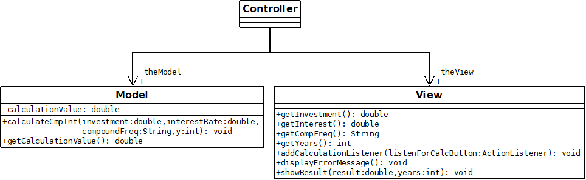

# Simple Java MVC

This is a simple example of a Model View Controller (MVC) Architecture, which has the goal of completely separating the Calculations and Interface from each other.

* Model: responsible for handling the data and calculations

* View: responsible for the interface

* Controller: responsible for coordinating interactions between the View and Model.

To exemplify this architecture, a simple compound interest calculator application is created in this project:

## Deploying

Make sure to have Java JDK installed. The run the following commands:

`javac App.java`

`java App`